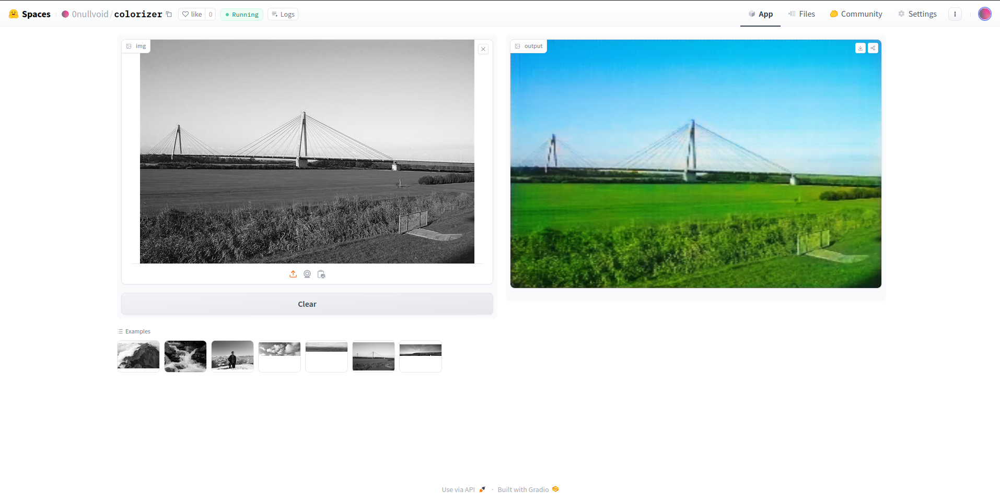

# Landscape Colorization using pix2pix

## Overview

This project showcases a landscape colorization application using the pix2pix model. The application has been deployed on Hugging Face using Gradio, allowing users to interact with the model through a web interface.

## Project Details

### Model Architecture: pix2pix

pix2pix is a type of Generative Adversarial Network (GAN) used for image-to-image translation tasks. It was introduced by Phillip Isola, Jun-Yan Zhu, Tinghui Zhou, and Alexei A. Efros in their 2017 paper "Image-to-Image Translation with Conditional Adversarial Networks."

#### How it Works

1. **Generative Adversarial Networks (GANs)**:
    - A GAN consists of two neural networks, a Generator (G) and a Discriminator (D), which are trained simultaneously through adversarial processes.
    - The Generator's task is to create realistic images from the input data.
    - The Discriminator's task is to distinguish between real images (from the training dataset) and fake images (produced by the Generator).

2. **Conditional GAN (cGAN)**:
    - pix2pix is a type of conditional GAN, meaning it generates images based on some input conditions.
    - In the context of pix2pix, the condition is the input black-and-white (grayscale) image that needs to be colorized.

3. **Training Process**:
    - **Generator**: Takes a grayscale image as input and generates a colorized image.
    - **Discriminator**: Evaluates the authenticity of the generated image compared to the real color image from the dataset.
    - The objective of the Generator is to "fool" the Discriminator into believing that the generated image is real.
    - The objective of the Discriminator is to correctly identify the real versus fake images.

4. **Loss Functions**:
    - **Adversarial Loss**: Encourages the Generator to produce images that are indistinguishable from real images.
    - **L1 Loss**: Measures the pixel-wise difference between the generated image and the ground truth image, ensuring that the colorized image is close to the actual color image.

### Interface

- **Gradio**: The user interface is built using Gradio, a Python library that creates customizable UI components for machine learning models. Gradio allows users to upload black-and-white images and receive colorized results instantly.

### Deployment

- **Hugging Face Spaces**: The application is hosted on Hugging Face Spaces, a platform that enables easy sharing and deployment of machine learning models and applications. By using Gradio and Hugging Face Spaces, the application is accessible to anyone with a web browser.

## How It Works

1. **Image Upload**: Users can upload a black-and-white landscape image through the Gradio interface.
2. **Model Processing**: The pix2pix model processes the uploaded image and generates a colorized version.
3. **Output**: The colorized image is displayed to the user, who can download it if desired.

## Demo

You can try out the application [here](https://huggingface.co/spaces/0nullvoid/colorizer).

## Results

Below are some examples of the landscape colorization results produced by the application:

- **Example**: 

## Acknowledgements

- **pix2pix**: Thanks to the creators of the pix2pix model.
- **Gradio**: For providing an easy-to-use interface for machine learning models.
- **Hugging Face**: For offering a platform to deploy and share machine learning applications.

## Contact

For any inquiries or feedback, please contact Shubham Gupta at [2023aib1017@iitrpr.ac.in].
